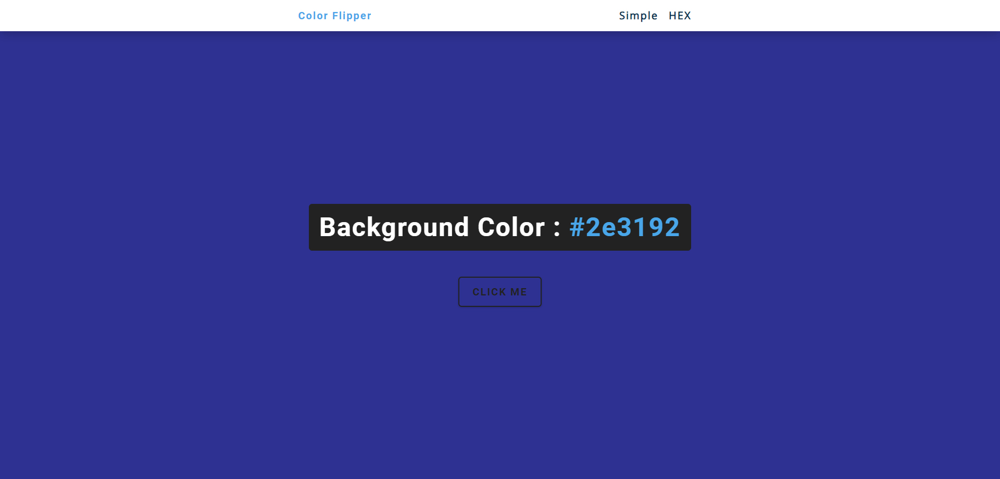

# To-Do List App
Hi, this repository contains a Color Flipper web application created using HTML, CSS, and JavaScript. The Color Flipper allows users to change the background color of the web page to a random color with the click of a button. It provides a simple and interactive way to explore different colors.

Built with:

  

## Output:

